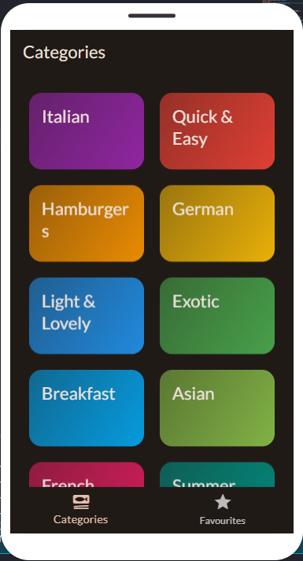

Meal Menu App

  <h2>Delicious Meals</h2>
  
  <h2>Meal Categories</h2>
  
  <h2>Recipe Details</h2>
  

Welcome to the Meal Menu Flutter App, your one-stop solution for exploring and managing delicious meals! Whether you're a cooking enthusiast, a foodie, or just someone who wants to discover new recipes, this Flutter-based meal menu app has got you covered.

Key Features
Explore Variety: Dive into a vast collection of meal categories ranging from breakfast to desserts.
Recipe Details: Access detailed information about each recipe, including ingredients, instructions, and nutritional facts.
Search Functionality: Easily find your favorite recipes or discover new ones with the search feature.
Favorites: Mark your favorite recipes for quick access later on.
Meal Planning: Plan your meals for the week by saving recipes to your meal planner.
Shopping List: Generate a shopping list based on the ingredients required for your selected recipes.
Offline Access: Access recipes and meal plans even when you're offline.
Customizable Settings: Adjust the app settings to tailor your experience according to your preferences.
Getting Started
Clone the Repository: Begin by cloning this repository to your local machine using git clone https://github.com/sudiptakrsarkarai/meal_menu_app.git.
Navigate to the Project Directory: Once cloned, navigate to the project directory using cd meal_menu_app.
Install Dependencies: Run flutter pub get to install all the necessary dependencies.
Launch the App: Connect your device or start an emulator/simulator, then run flutter run to launch the application.
Resources
Flutter Documentation: Explore the official Flutter documentation for in-depth guides, tutorials, and resources on building Flutter apps.
Flutter Docs
Pub.dev: Discover additional packages and plugins for enhancing your Flutter projects on the official pub.dev website.
pub.dev
Contributions Welcome!
We believe in collaborative development. Whether you have ideas for new features, find a bug, or want to contribute in any way, we welcome your involvement!

License
This project is licensed under the MIT License. For details, see the LICENSE file.

  Crafted with passion by [Sudipta Kumar Sarkar](https://github.com/sudiptakrsarkarai)

